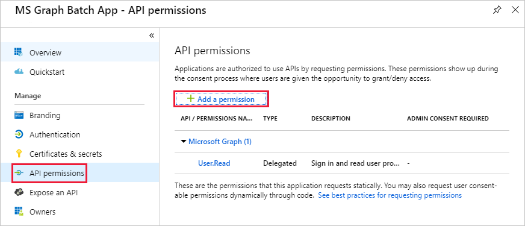

<!-- markdownlint-disable MD002 MD041 -->

この演習では、カスタムコネクタに対して委任されたアクセス許可を提供するために使用される新しい Azure Active Directory アプリケーションを作成します。In this exercise, you will create a new Azure Active Directory Application which will be used to provide the delegated permissions for the custom connector.

ブラウザーを開き、 [Azure Active Directory 管理センター](https://aad.portal.azure.com)に移動します。Open a browser and navigate to [Azure Active Directory admin center](https://aad.portal.azure.com). 左側のナビゲーションメニューで [ **Azure Active directory** ] リンクを選択し、 **azure active directory** ブレードの [ **管理** ] セクションで [ **アプリの登録** ] エントリを選択します。Choose the **Azure Active Directory** link in the left navigation menu, then choose the **App registrations** entry in the **Manage** section of the **Azure Active Directory** blade.

**アプリ登録** ブレードの上部にある [ **新しい登録** ] メニュー項目を選択します。Choose the **New registration** menu item at the top of the **App Registrations** blade.

`MS Graph Batch App`[ **名前** ] フィールドにを入力します。Enter `MS Graph Batch App` in the **Name** field. [ **サポートされているアカウントの種類** ] セクションで、 **任意の組織ディレクトリの [アカウント** ] を選択します。In the **Supported account types** section, select **Accounts in any organizational directory**. [ **リダイレクト URI** ] セクションを空白のままにして、[ **登録** ] を選択します。Leave the **Redirect URI** section blank and choose **Register**.

**MS Graph バッチアプリ** ブレードで、 **アプリケーション (クライアント) ID** をコピーします。On the **MS Graph Batch App** blade, copy the **Application (client) ID**. 次の手順でこれを行う必要があります。You'll need this in the next exercise.

**MS Graph バッチアプリ** ブレードの [ **管理** ] セクションで、 **API アクセス許可** エントリを選択します。Choose the **API permissions** entry in the **Manage** section of the **MS Graph Batch App** blade. [ **API アクセス許可** ] の下で [ **アクセス許可の追加** ] を選択します。Choose **Add a permission** under **API permissions**.

[ **API アクセス許可の要求** ] ブレードで、 **Microsoft Graph** を選択し、[委任された **アクセス許可** ] を選択します。In the **Request API permissions** blade, choose the **Microsoft Graph** , then choose **Delegated permissions**. [検索 `group` ] を選択し、[ **すべてのグループの読み取りと書き込み** ] アクセス許可を選択します。Search for `group`, then select the **Read and write all groups** delegated permission. ブレードの下部にある [ **アクセス許可の追加** ] を選択します。Choose **Add permissions** at the bottom of the blade.

 

**MS Graph バッチアプリ** ブレードの [ **管理** ] セクションで、[ **証明書と秘密** ] エントリを選択し、[ **新しいクライアントシークレット** ] を選択します。Choose the **Certificates and secrets** entry in the **Manage** section of the **MS Graph Batch App** blade, then choose **New client secret**. `forever`**説明** にを入力し、[ **期限切れ** ] の下で [ **なし** ] を選択します。Enter `forever` in the **Description** and select **Never** under **Expires**. **[追加]** を選択します。Choose **Add**.

新しいシークレットの値をコピーします。Copy the value for the new secret. 次の手順でこれを行う必要があります。You'll need this in the next exercise.

> [!IMPORTANT]
> この手順は、このブレードを閉じたときにシークレットにアクセスできないため、重要です。This step is critical as the secret will not be accessible once you close this blade. このシークレットをテキストエディターに保存して、今後の演習で使用できるようにします。Save this secret to a text editor for use in upcoming exercises.

Teams プロパティなど、Microsoft Graph からアクセスできる追加のサービスの管理を有効にするには、特定のサービスの管理を有効にするために、追加の適切なスコープを選択する必要があります。To enable management of additional services accessible via the Microsoft Graph, including Teams properties, you would need to select additional, appropriate scopes to enable managing specific services. たとえば、OneNote ノートブックまたはプランナープラン、バケット、タスクの作成を可能にするソリューションを拡張するには、関連する Api に必要なアクセス許可スコープを追加する必要があります。For example, to extend our solution to enable creating OneNote Notebooks or Planner plans, buckets and tasks you would need to add the required permission scopes for the relevant APIs.
