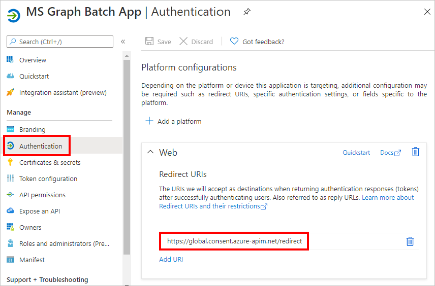

<!-- markdownlint-disable MD002 MD041 -->

この演習では、Microsoft Power オートメーションまたは Azure ロジックアプリで使用できる新しいカスタムコネクタを作成します。 OpenAPI 定義ファイルには、Microsoft Graph エンドポイントの正しいパス `$batch` と、簡易インポートを有効にするための追加設定があらかじめ用意されています。

Microsoft Graph 用のカスタムコネクタを作成するには、次の2つのオプションがあります。

- 空白からの作成
- OpenAPI ファイルをインポートする

## オプション 1: 空のテンプレートからカスタムコネクタを作成する

ブラウザーを開き、[ [Microsoft Power オートメーション](https://flow.microsoft.com)] に移動します。 Office 365 テナント管理者アカウントでサインインします。 左側のメニューで [ **データ** ] を選択し、ドロップダウンメニューの [ **カスタムコネクタ** ] 項目を選択します。

[ **カスタムコネクタ** ] ページの右上にある [ **新しいカスタムコネクタ** ] リンクを選択し、ドロップダウンメニュー **から [空のアイテムを作成** する] を選択します。

[ `MS Graph Batch Connector` **コネクタ名** ] テキストボックスにを入力します。 Choose **Continue**.

[コネクタ構成の **全般** ] ページで、フィールドに次のように入力します。

- **スキーム** : HTTPS
- **ホスト** : `graph.microsoft.com`
- **ベース URL** : `/`

[ **セキュリティ** ] ボタンを選択して続行します。

![コネクタ構成の [全般] タブのスクリーンショット](./images/general-tab.png)

[ **セキュリティ** ] ページで、フィールドに次のように入力します。

- **API によって実装されている認証を選択し** ます。 `OAuth 2.0`
- **Id プロバイダー** : `Azure Active Directory`
- **クライアント id** : 前の手順で作成したアプリケーション id
- **クライアントシークレット** : 前の手順で作成したキー
- **ログイン url** : `https://login.windows.net`
- **テナント ID** : `common`
- **リソース URL** : `https://graph.microsoft.com` (末尾がありません)
- **範囲** : 空白のままにする

[ **定義** ] ボタンを選択して続行します。

![コネクタ構成の [セキュリティ] タブのスクリーンショット](./images/security-tab.png)

[ **定義** ] ページで、[ **新しいアクション** ] を選択し、フィールドに次のように入力します。

- **概要** : `Batch`
- **説明** : `Execute Batch with Delegate Permission`
- **操作 ID** : `Batch`
- **表示** : `important`

![コネクタ構成の [定義] タブのスクリーンショット](./images/definition-tab.png)

[ **Sample からインポート** ] を選択し、フィールドに次のように入力して **要求** を作成します。

- **動詞** : `POST`
- **URL** : `https://graph.microsoft.com/v1.0/$batch`
- **ヘッダー** : 空白のままにする
- **本文** : `{}`

**[インポート]** を選択します。

![コネクタ構成の [インポート元サンプル] ダイアログのスクリーンショット](./images/import-sample.png)

右上にある [ **コネクタの作成** ] を選択します。 コネクタが作成されたら、[ **セキュリティ** ] ページから、生成された **リダイレクト URL** をコピーします。

前の手順で作成した [Azure Portal](https://aad.portal.azure.com) の登録済みアプリケーションに戻ります。 左側のメニューで [ **認証** ] を選択します。 **[プラットフォームを追加]** を選択して、 **[Web]** を選択します。 **リダイレクト uri** の前の手順でコピーしたリダイレクト URL を入力し、[ **構成** ] を選択します。

## オプション 2: OpenAPI ファイルをインポートしてカスタムコネクタを作成する

テキストエディターを使用して、という名前の新しい空のファイルを作成 `MSGraph-Delegate-Batch.swagger.json` し、次のコードを追加します。

[!code-json]

ブラウザーを開き、[ [Microsoft Power オートメーション](https://flow.microsoft.com)] に移動します。 Office 365 テナント管理者アカウントでサインインします。 左側のメニューで [ **データ** ] を選択し、ドロップダウンメニューの [ **カスタムコネクタ** ] 項目を選択します。

[ **カスタムコネクタ** ] ページの右上にある [ **新しいカスタムコネクタ** ] リンクを選択し、ドロップダウンメニューから [ **openapi ファイルをインポートする** ] 項目を選択します。

[ `MS Graph Batch Connector` **コネクタ名** ] テキストボックスにを入力します。 [フォルダー] アイコンを選択して、OpenAPI ファイルをアップロードします。 作成したファイルを参照し `MSGraph-Delegate-Batch.swagger.json` ます。 [ **続行** ] を選択して、openapi ファイルをアップロードします。

[コネクタの構成] ページで、ナビゲーションメニューの [ **セキュリティ** ] リンクを選択します。 フィールドに次のように入力します。

- **API によって実装されている認証を選択し** ます。 `OAuth 2.0`
- **Id プロバイダー** : `Azure Active Directory`
- **クライアント id** : 前の手順で作成したアプリケーション id
- **クライアントシークレット** : 前の手順で作成したキー
- **ログイン url** : `https://login.windows.net`
- **テナント ID** : `common`
- **リソース URL** : `https://graph.microsoft.com` (末尾がありません)
- **範囲** : 空白のままにする

右上にある [ **コネクタの作成** ] を選択します。 コネクタが作成されたら、生成された **リダイレクト URL** をコピーします。

前の手順で作成した [Azure Portal](https://aad.portal.azure.com) の登録済みアプリケーションに戻ります。 左側のメニューで [ **認証** ] を選択します。 **[プラットフォームを追加]** を選択して、 **[Web]** を選択します。 **リダイレクト uri** の前の手順でコピーしたリダイレクト URL を入力し、[ **構成** ] を選択します。

