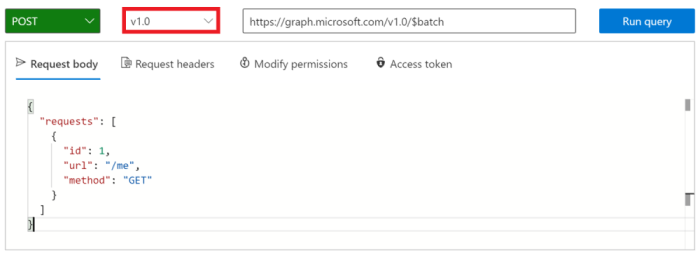
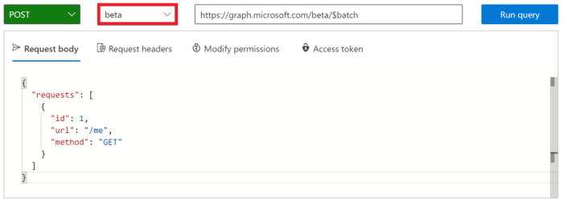

<!-- markdownlint-disable MD002 MD041 -->

新しいコネクタを使用するフローを作成する前に、 [Microsoft Graph エクスプローラ](https://developer.microsoft.com/graph/graph-explorer) を使用して、microsoft graph での JSON バッチの機能の一部を確認してください。

ブラウザーで [Microsoft Graph エクスプローラー](https://developer.microsoft.com/graph/graph-explorer) を開きます。 Office 365 テナント管理者アカウントでサインインします。 **サンプルクエリ** から for **Batch** を検索します。

左側のメニューで、[ **並列実行** ] サンプルクエリを選択します。 画面の右上にある [ **クエリの実行** ] ボタンをクリックします。

![Graph Explorer の [クエリのサンプル] タブのスクリーンショット](./images/sample-queries.png)

サンプルのバッチ操作は、3つの HTTP GET 要求をバッチ処理して、Graph エンドポイントに対する1つの HTTP POST を発行し `/v1.0/$batch` ます。

```json
{
    "requests": [
        {
            "url": "/me?$select=displayName,jobTitle,userPrincipalName",
            "method": "GET",
            "id": "1"
        },
        {
            "url": "/me/messages?$filter=importance eq 'high'&$select=from,subject,receivedDateTime,bodyPreview",
            "method": "GET",
            "id": "2"
        },
        {
            "url": "/me/events",
            "method": "GET",
            "id": "3"
        }
    ]
}
```

返された応答は次のとおりです。 Microsoft Graph によって返される応答の配列をメモします。 バッチ処理された要求に対する応答は、投稿の要求の順序とは別の順序で表示されることがあります。 このプロパティを使用して、 `id` 個々のバッチ要求と特定のバッチ応答を関連付けます。

> [!NOTE]
> 読みやすくするために、応答は切り詰められています。

```json
{
  "responses": [
    {
      "id": "1",
      "status": 200,
      "headers": {...},
      "body": {...}
    },
    {
      "id": "3",
      "status": 200,
      "headers": {...},
      "body": {...}
    }
    {
      "id": "2",
      "status": 200,
      "headers": {...},
      "body": {...}
    }
  ]
}
```

各応答には、、、 `id` `status` `headers` 、およびプロパティが含まれ `body` ます。 要求のプロパティがエラーを示している場合、 `status` には、 `body` 要求から返されたエラー情報が含まれています。

要求の操作の順序を確認するには、 [dependsOn](https://docs.microsoft.com/graph/json-batching#sequencing-requests-with-the-dependson-property) プロパティを使用して個々の要求を順序付けできます。

JSON バッチは、シーケンス処理および依存操作に加えて、基本パスを想定し、相対パスからの要求を実行します。 各 batch 要求要素は、 `/v1.0/$batch` `/beta/$batch` 指定されたとおりにまたはのいずれかのエンドポイントから実行されます。 エンドポイントでは、エンドポイント `/beta` に返されない追加の出力が返される可能性があるため、これには大きな違いがあり `/v1.0` ます。

たとえば、 [Microsoft Graph Explorer](https://developer.microsoft.com/graph/graph-explorer)で次の2つのクエリを実行します。

1. Url を使用してエンドポイントに対してクエリを実行し `/v1.0/$batch` `/me` ます (以下のコピーと貼り付け要求)。

```json
{
  "requests": [
    {
      "id": 1,
      "url": "/me",
      "method": "GET"
    }
  ]
}
```



次に、バージョン選択ドロップダウンを使用して `beta` エンドポイントに変更し、まったく同じ要求を行います。



返される結果の違いは何ですか。 いくつかの相違点を特定するには、他のクエリを試してみてください。

およびエンドポイントからの応答コンテンツに加えて `/v1.0` `/beta` 、アクセス許可が付与されていないバッチ要求が行われた場合のエラーについて理解することが重要です。 たとえば、次に示すのは、OneNote ノートブックを作成するためのバッチ要求アイテムです。

```json
{
  "id": 1,
  "url": "/groups/65c5ecf9-3311-449c-9904-29a2c76b9a50/onenote/notebooks",
  "headers": {
    "Content-Type": "application/json"
  },
  "method": "POST",
  "body": {
    "displayName": "Meeting Notes"
  }
}
```

ただし、OneNote ノートブックを作成するためのアクセス許可が付与されていない場合は、次の応答が受信されます。 状態コードと、 `403 (Forbidden)` 指定された OAuth トークンを示すエラーメッセージには、要求された操作を完了するために必要なスコープが含まれていないことに注意してください。

```json
{
  "responses": [
    {
      "id": "1",
      "status": 403,
      "headers": {
        "Cache-Control": "no-cache"
      },
      "body": {
        "error": {
          "code": "40004",
          "message": "The OAuth token provided does not have the necessary scopes to complete the request.
            Please make sure you are including one or more of the following scopes: Notes.ReadWrite.All,
            Notes.Read.All (you provided these scopes: Group.Read.All,Group.ReadWrite.All,User.Read,User.Read.All)",
          "innerError": {
            "request-id": "92d50317-aa06-4bd7-b908-c85ee4eff0e9",
            "date": "2018-10-17T02:01:10"
          }
        }
      }
    }
  ]
}
```

バッチ内の各要求は、状態コードと結果またはエラー情報を返します。 各応答を処理して、個々のバッチ操作の成功または失敗を判断する必要があります。
