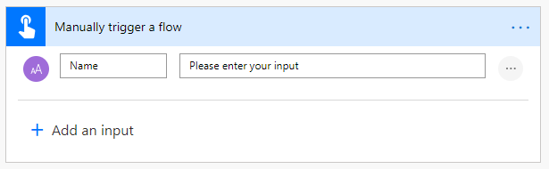

<!-- markdownlint-disable MD002 MD041 -->

<span data-ttu-id="a1a85-101">この演習では、前の手順で作成したカスタムコネクタを使用して Microsoft teams を作成して構成するフローを作成します。</span><span class="sxs-lookup"><span data-stu-id="a1a85-101">In this exercise, you will create a flow to use the custom connector you created in previous exercises to create and configure a Microsoft Team.</span></span> <span data-ttu-id="a1a85-102">このフローでは、カスタムコネクタを使用して、Office 365 統合グループを作成するために POST 要求を送信します。グループの作成が完了するまで待機し、その後、PUT 要求を送信して、グループを Microsoft チームに関連付けます。</span><span class="sxs-lookup"><span data-stu-id="a1a85-102">The flow will use the custom connector to send a POST request to create an Office 365 Unified Group, will pause for a delay while the group creation completes, and then will send a PUT request to associate the group with a Microsoft Team.</span></span>

<span data-ttu-id="a1a85-103">最終的に、フローは次のようになります。</span><span class="sxs-lookup"><span data-stu-id="a1a85-103">In the end your flow will look similar to the following image:</span></span>


<span data-ttu-id="a1a85-105">ブラウザーで [Microsoft Power オートメーション](https://flow.microsoft.com) を開き、Office 365 テナント管理者アカウントでサインインします。</span><span class="sxs-lookup"><span data-stu-id="a1a85-105">Open [Microsoft Power Automate](https://flow.microsoft.com) in your browser and sign in with your Office 365 tenant administrator account.</span></span> <span data-ttu-id="a1a85-106">左側のナビゲーションで [ **マイフロー** ] を選択します。</span><span class="sxs-lookup"><span data-stu-id="a1a85-106">Choose **My flows** in the left-hand navigation.</span></span> <span data-ttu-id="a1a85-107">[ **新規** ] を選択し、[ **インスタント** ] を選択します。</span><span class="sxs-lookup"><span data-stu-id="a1a85-107">Choose **New** , then **Instant--from blank**.</span></span> <span data-ttu-id="a1a85-108">[ `Create Team` **フロー名** ] に入力してから、[ **このフローをトリガーする方法を選択** してください] で [ **フローを手動でトリガー** する] を選択します。</span><span class="sxs-lookup"><span data-stu-id="a1a85-108">Enter `Create Team` for **Flow name** , then select **Manually trigger a flow** under **Choose how to trigger this flow**.</span></span> <span data-ttu-id="a1a85-109">**[作成]** を選択します。</span><span class="sxs-lookup"><span data-stu-id="a1a85-109">Choose **Create**.</span></span>

<span data-ttu-id="a1a85-110">[フロー項目を **手動でトリガーする** ] を選択し、[ **入力を追加** する] を選択し、 **テキスト** を選択して、タイトルとしてを入力し `Name` ます。</span><span class="sxs-lookup"><span data-stu-id="a1a85-110">Select the **Manually trigger a flow** item, then choose **Add an input** , select **Text** and enter `Name` as the title.</span></span>



<span data-ttu-id="a1a85-112">[ **新しい手順** ] を選択し `Batch` 、検索ボックスに入力します。</span><span class="sxs-lookup"><span data-stu-id="a1a85-112">Choose **New step** and type `Batch` in the search box.</span></span> <span data-ttu-id="a1a85-113">[ **MS Graph バッチコネクタ** ] アクションを追加します。</span><span class="sxs-lookup"><span data-stu-id="a1a85-113">Add the **MS Graph Batch Connector** action.</span></span> <span data-ttu-id="a1a85-114">省略記号を選択して、このアクションの名前をに変更 `Batch POST-groups` します。</span><span class="sxs-lookup"><span data-stu-id="a1a85-114">Choose the ellipsis and rename this action to `Batch POST-groups`.</span></span>

<span data-ttu-id="a1a85-115">アクションの **本文** テキストボックスに次のコードを追加します。</span><span class="sxs-lookup"><span data-stu-id="a1a85-115">Add the following code into the **body** text box of the action.</span></span>

```json
{
  "requests": [
    {
      "url": "/groups",
      "method": "POST",
      "id": 1,
      "headers": { "Content-Type": "application/json" },
      "body": {
        "description": "REPLACE",
        "displayName": "REPLACE",
        "groupTypes": ["Unified"],
        "mailEnabled": true,
        "mailNickname": "REPLACE",
        "securityEnabled": false
      }
    }
  ]
}
```

<span data-ttu-id="a1a85-116">`REPLACE` `Name` [ **動的コンテンツの追加** ] メニューから手動トリガーの値を選択して、各プレースホルダーを置き換えます。</span><span class="sxs-lookup"><span data-stu-id="a1a85-116">Replace each `REPLACE` placeholder by selecting the `Name` value from the manual trigger from the **Add dynamic content** menu.</span></span>

![Microsoft Flow の [動的コンテンツ] メニューのスクリーンショット](./images/dynamic-content.png)

<span data-ttu-id="a1a85-118">[ **新しい手順** ] を選択し、 `delay` **遅延** アクションを検索して追加して、1分間構成します。</span><span class="sxs-lookup"><span data-stu-id="a1a85-118">Choose **New step** , search for `delay` and add a **Delay** action and configure for 1 minute.</span></span>

<span data-ttu-id="a1a85-119">[ **新しい手順** ] を選択し `Batch` 、検索ボックスに入力します。</span><span class="sxs-lookup"><span data-stu-id="a1a85-119">Choose **New step** and type `Batch` in the search box.</span></span> <span data-ttu-id="a1a85-120">[ **MS Graph バッチコネクタ** ] アクションを追加します。</span><span class="sxs-lookup"><span data-stu-id="a1a85-120">Add the **MS Graph Batch Connector** action.</span></span> <span data-ttu-id="a1a85-121">省略記号を選択して、このアクションの名前をに変更 `Batch PUT-team` します。</span><span class="sxs-lookup"><span data-stu-id="a1a85-121">Choose the ellipsis and rename this action to `Batch PUT-team`.</span></span>

<span data-ttu-id="a1a85-122">アクションの **本文** テキストボックスに次のコードを追加します。</span><span class="sxs-lookup"><span data-stu-id="a1a85-122">Add the following code into the **body** text box of the action.</span></span>

```json
{
  "requests": [
    {
      "id": 1,
      "url": "/groups/REPLACE/team",
      "method": "PUT",
      "headers": {
        "Content-Type": "application/json"
      },
      "body": {
        "memberSettings": {
          "allowCreateUpdateChannels": true
        },
        "messagingSettings": {
          "allowUserEditMessages": true,
          "allowUserDeleteMessages": true
        },
        "funSettings": {
          "allowGiphy": true,
          "giphyContentRating": "strict"
        }
      }
    }
  ]
}
```

<span data-ttu-id="a1a85-123">プレースホルダーを選択し、 `REPLACE` [動的コンテンツ] ウィンドウで [ **式** ] を選択します。</span><span class="sxs-lookup"><span data-stu-id="a1a85-123">Select the `REPLACE` placeholder, then select **Expression** in the dynamic content pane.</span></span> <span data-ttu-id="a1a85-124">次の数式を **式** に追加します。</span><span class="sxs-lookup"><span data-stu-id="a1a85-124">Add the following formula into the **Expression**.</span></span>

```js
body('Batch_POST-groups').responses[0].body.id
```

![[動的コンテンツ] ウィンドウ内の式のスクリーンショット](./images/flow-formula.png)

<span data-ttu-id="a1a85-126">この式では、最初のアクションの結果からグループ ID を使用することを指定します。</span><span class="sxs-lookup"><span data-stu-id="a1a85-126">This formula specifies that we want to use the group ID from the result of the first action.</span></span>


<span data-ttu-id="a1a85-128">[ **保存** ] を選択し、[ **テスト** ] を選択してフローを実行します。</span><span class="sxs-lookup"><span data-stu-id="a1a85-128">Choose **Save** , then choose **Test** to execute the flow.</span></span>

> [!TIP]
> <span data-ttu-id="a1a85-129">このようなエラーが表示される場合は `The template validation failed: 'The action(s) 'Batch_POST-groups' referenced by 'inputs' in action 'Batch_2' are not defined in the template'` 、式が正しくないため、検索できないフローアクションが参照されている可能性があります。</span><span class="sxs-lookup"><span data-stu-id="a1a85-129">If you receive an error like `The template validation failed: 'The action(s) 'Batch_POST-groups' referenced by 'inputs' in action 'Batch_2' are not defined in the template'`, the expression is incorrect and likely references a flow action it cannot find.</span></span> <span data-ttu-id="a1a85-130">参照しているアクション名が正確に一致することを確認します。</span><span class="sxs-lookup"><span data-stu-id="a1a85-130">Ensure that the action name you are referencing matches exactly.</span></span>

<span data-ttu-id="a1a85-131">[トリガーアクションを **実行する** ] ラジオボタンを選択して、[ **Save & Test** ] を選択します。</span><span class="sxs-lookup"><span data-stu-id="a1a85-131">Choose the **I'll perform the trigger** action radio button and choose **Save & Test**.</span></span> <span data-ttu-id="a1a85-132">ダイアログの [ **続行** ] を選択します。</span><span class="sxs-lookup"><span data-stu-id="a1a85-132">Choose **Continue** in the dialog.</span></span> <span data-ttu-id="a1a85-133">スペースを含まない名前を指定し、[ **実行フロー** ] を選択してチームを作成します。</span><span class="sxs-lookup"><span data-stu-id="a1a85-133">Provide a name without spaces, and choose **Run flow** to create a Team.</span></span>

![[実行フロー] ダイアログのスクリーンショット](./images/run-flow.png)

<span data-ttu-id="a1a85-135">最後に、[ **完了** ] を選択して、アクティビティログを表示します。</span><span class="sxs-lookup"><span data-stu-id="a1a85-135">Finally, choose the **Done** to see the activity log.</span></span> <span data-ttu-id="a1a85-136">フローが完了すると、Office 365 グループとチームが構成されました。</span><span class="sxs-lookup"><span data-stu-id="a1a85-136">Once the flow completes, your Office 365 Group and Team have been configured.</span></span> <span data-ttu-id="a1a85-137">バッチアクションアイテムを選択して、JSON バッチ呼び出しの結果を表示します。</span><span class="sxs-lookup"><span data-stu-id="a1a85-137">Select the Batch action items to view the results of the JSON Batch calls.</span></span> <span data-ttu-id="a1a85-138">`outputs` `Batch PUT-team` アクションの状態コードは、次の図のようなチームの関連付けを成功させるために201の状態コードである必要があります。</span><span class="sxs-lookup"><span data-stu-id="a1a85-138">The `outputs` of the `Batch PUT-team` action should have a status code of 201 for a successful Team association similar to the image below.</span></span>


